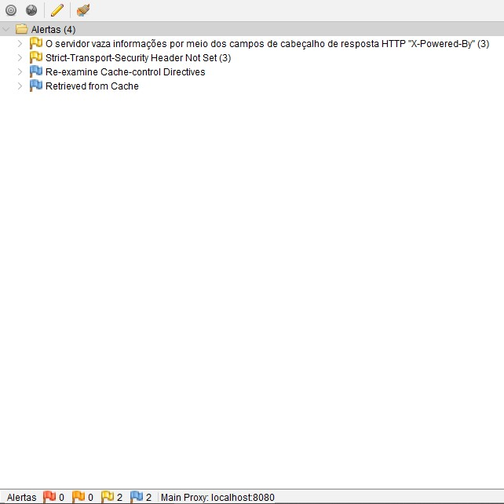

# Relatório de Testes de Segurança com OWASP ZAP

Este relatório documenta os testes de segurança realizados nas APIs desenvolvidas pelo nosso time na fase V do curso de pós-graduação em arquitetura de software da FIAP - 3SOAT, utilizando a ferramenta [OWASP ZAP](https://www.zaproxy.org/). O objetivo dos testes é identificar e mitigar potenciais vulnerabilidades de segurança que possam impactar a integridade, confidencialidade e disponibilidade das APIs.

## Membros:
- [Camila Lemos de Melo - RM 352359]()
- [Christian Soares Santos - RM 351509](https://www.linkedin.com/in/christian-soares-93250a170/)
- [Fábio Guimarães Martins - RM 351825](https://www.linkedin.com/in/fabio-martins-2021)
- [Josué Batista Cruz Júnior - RM 352045](https://www.linkedin.com/in/josuejuniorjf/)

## Ferramenta Utilizada

Utilizamos o OWASP ZAP (Zed Attack Proxy) para conduzir uma análise abrangente das APIs. Esta ferramenta é amplamente utilizada para identificar vulnerabilidades de segurança em aplicações web, incluindo APIs, através de técnicas de scanning automatizadas e testes manuais.


## Escopo dos Testes

Os testes foram realizados em 4 APIs, conforme escopo do TechChallenge. O escopo do teste incluiu:

- **Teste de Varredura Automática**: Realizou uma análise abrangente das APIs para detectar vulnerabilidades conhecidas, como Injeção de SQL, Cross-Site Scripting (XSS), e Injeção de Comandos.
- **Teste de Autenticação e Autorização**: Verificou se os mecanismos de autenticação e autorização das APIs estavam corretamente implementados, garantindo que apenas usuários autorizados pudessem acessar recursos sensíveis.
- **Teste de Segurança em Tráfego**: Validou se as comunicações das APIs estavam protegidas por HTTPS e se havia proteção contra ataques de Man-in-the-Middle (MitM).
- **Teste de Entrada de Dados**: Verificou se as APIs validavam corretamente as entradas fornecidas pelos usuários, prevenindo ataques baseados em dados maliciosos.

## Resultados Obtidos

Após a execução dos testes, não foram encontrados alertas críticos, sendo assim, fizemos o ajuste dos alertas de **média prioridade**. Segue as análises:

### A. **LISTAR/EXIBIR CARDÁPIO**
  

- **[Content Security Policy (CSP) Header Not Set]**:
  
  
  
  - **Solução**: Com base na [documentação da AWS](https://docs.aws.amazon.com/AmazonCloudFront/latest/DeveloperGuide/example-function-add-security-headers.html), adicionamos um handler em nossas requsições onde adicionamos vários cabeçalhos HTTP comuns relacionados à Content Security Policy.
 ``` javascript
    headers['strict-transport-security'] = { value: 'max-age=63072000; includeSubdomains; preload'}; 
    headers['content-security-policy'] = { value: "default-src 'none'; img-src 'self'; script-src 'self'; style-src 'self'; object-src 'none'; frame-ancestors 'none'"}; 
    headers['x-content-type-options'] = { value: 'nosniff'}; 
    headers['x-frame-options'] = {value: 'DENY'}; 
    headers['x-xss-protection'] = {value: '1; mode=block'};
    headers['referrer-policy'] = {value: 'same-origin'};
 ```
- **[Missing Anti-clickjacking Header]**:
  
  
  
  - **Solução**: Com base na mesma [documentação da AWS](https://docs.aws.amazon.com/AmazonCloudFront/latest/DeveloperGuide/example-function-add-security-headers.html) conseguimos resolver também esse problema.

### B. **REALIZAÇÃO DE PEDIDO (CHECKOUT)**
  

- **[Tivemos apenas um alerta de baixa prioridade, sem necessidade de ajustes.]**

### C. **GERAÇÃO DO PAGAMENTO**
  

- **[Tivemos apenas dois alertas. Um de baixa prioridade e outro alerta informacional, sem necessidade de ajustes.]**

### D. **CONFIRMAÇÃO DO PAGAMENTO (WEBHOOK)**
  

- **[Tivemos apenas quatro alertas. Dois de baixa prioridade e dois alertas informacionais, sem necessidade de ajustes.]**

## Conclusão

Os testes realizados pelo OWASP ZAP revelaram importantes pontos de atenção na segurança das APIs testadas. As vulnerabilidades identificadas devem ser tratadas com prioridade para garantir a segurança e a continuidade das operações. A adoção das medidas corretivas e das boas práticas de segurança recomendadas contribuirá significativamente para reduzir os riscos e proteger as informações críticas do sistema.
